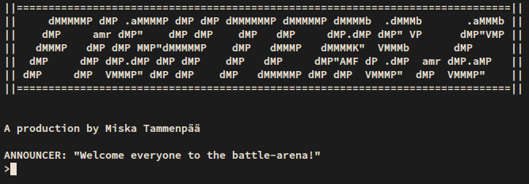

# fighters
Course project for Aalto University course ELEC-A7100 (Basic Course in C programming). A small scale text-based "role-playing game" where you create characters and make them fight.

</img>

## Building
Compile with
```
gcc fighters.c -o fighters
```
(Or another similar command if you have a different compiler)

## Playing
Description       |Command
------------------|:---------------------------------
Add character:    |  A {NAME} {HP} {WEAPON} {MAXDMG}                                                                                                                                                                      
Attack character: |  H {ATTACKERNAME} {DEFENDERNAME} 
Write into file:   |  W {FILENAME}                    
Read from file:    |  R {FILENAME}                    
Print characters: |  L                               
Print help:       |  ?                               
Close program:    |  Q                               
