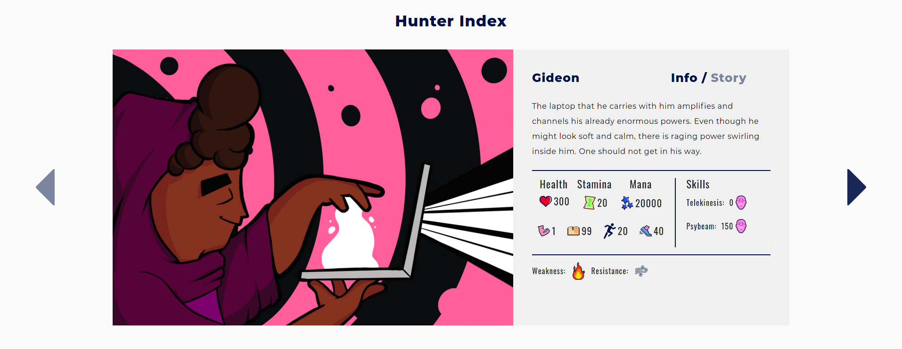

# Hoxhunters Summer Hunters Frontend assignment

## Live demo at [mtammenpaa.com](http://mtammenpaa.com/hoxhunt)



## Technologies & dependencies
Built with Typescript, React and Styled components. Uses React Bootstrap for a few UI elements. Connection to backend is done with Apollo and GraphQL.

## Quick start
Clone the repository and run yarn inside
```
git clone https://github.com/SirLarion/hoxhunt_pre-assignment.git
cd hoxhunt_pre-assignment && yarn
```
You can then start the backend and frontend 
```
yarn start:back
yarn start:front
```
(Note: frontend only displays an error message if backend is unavailable)

## Docz
Component documentation is available in docz server. You can start it with either of the scripts below:
```
yarn docz:dev
yarn docz:serve
```
