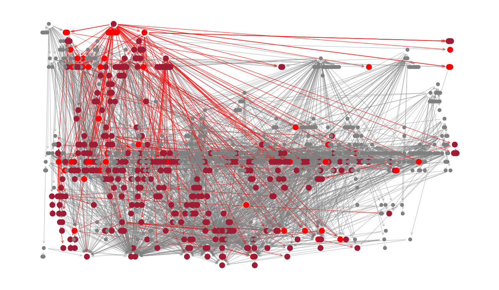

# libnet

Course project for Aalto University course TU-C9270. Visualizing networks of Python dependencies in Github projects.

</img>
A network of 930 library nodes. Visualized by setting static positions for some of the libraries with the most dependencies and then using NetworkX spring layout for the rest
</img>
The same network in a DAG styled layout with the direct dependencies (RED) and transitive dependencies (DARK RED) of a single library accentuated

### Setup
1. Create a file called ".env" in the root of the project
2. Get an OAuth2 token for your GitHub user (see https://docs.github.com/en/free-pro-team@latest/developers/apps/building-oauth-apps)
3. Copy the token into your .env file
### Using
You can run libnet simply with
```
python libnet.py
```
This builds a network of 10 library nodes and displays it with MatPlotLib and NetworkX
<br></br>
You can also specify the desired size of the network by giving it as a parameter. For example
```
python libnet.py 500
```
builds a network of 500 library nodes
<br></br>
Libnet saves a snapshot of the current network for every 15 library nodes added and also after running the program to completion. You can continue from the previous snapshot by giving "--continue" or "-c" as a parameter after the desired size of the network
```
python libnet.py 1000 --continue
```
After running the previous command this would continue building from a size 500 network until it has 1000 library nodes
